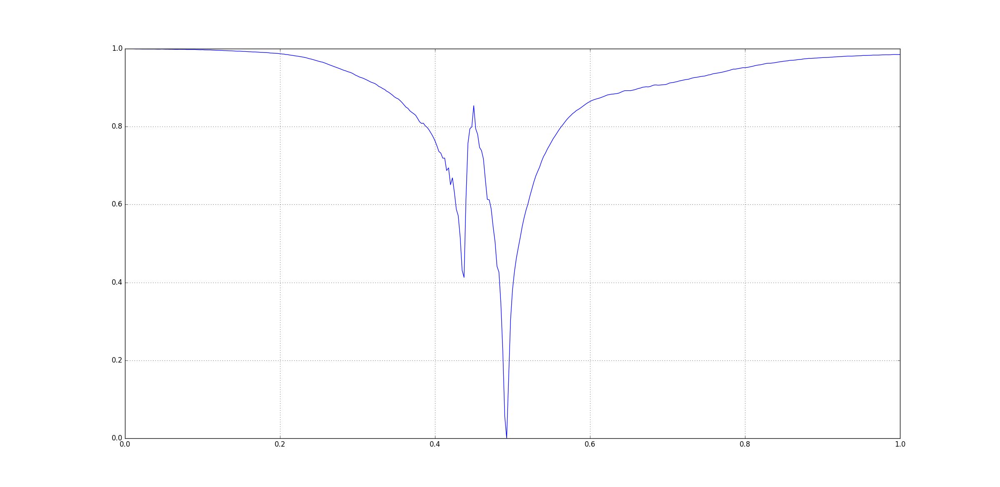
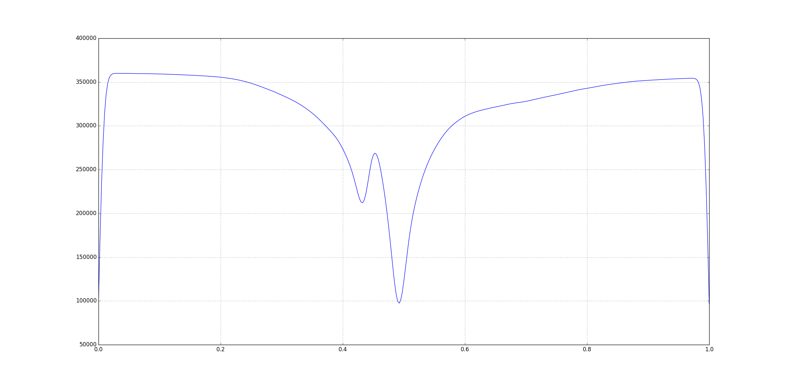
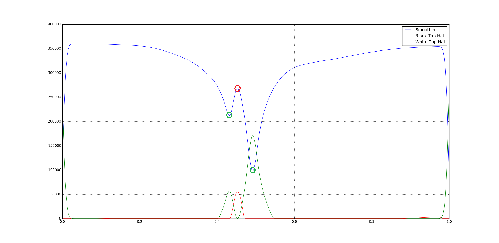
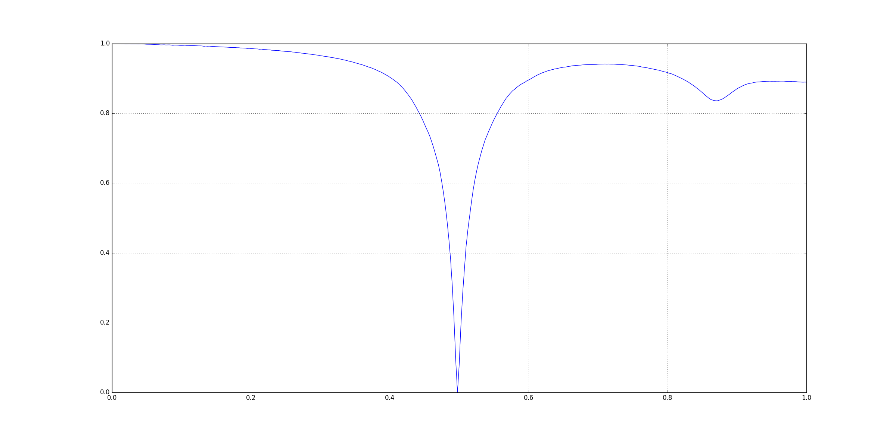
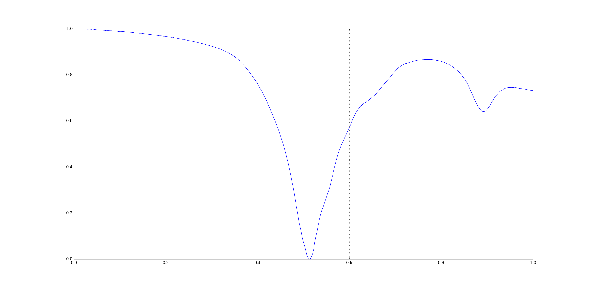
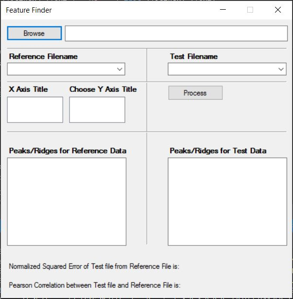

## CurveMatcher

**Problem Statement:** How can I find peaks and troughs of a graph? How to find relative error and correlation between two graphs?

**Languages:** C++

**Build Tool:** CMake 3.5

**Additional Libraries:** Boost 1.61.0

**Source**: [https://github.com/apanimesh061/CurveMatcher](https://github.com/apanimesh061/CurveMatcher)

I will be discussing about the algorithms and techniques that I used to solve the above mentioned problem.

#### Input Type
The console application that I built takes in CSV (Comma Seperated Values) as an inputs. 

1. Point the application to a directory which has a number of CSV files.
2. Choose 2 CSV files where there is one `Reference` and one `Test` file

   Reference file is the file with which the Test file is compared and the `relative error` and `correlation coefficient` is reported.
   Operations that return peaks and other features are related to the individual graphs.
3. Make sure that the CSVs have a similar strucure. You cannot compare two plots if they do not have same number of data points.
4. Each CSV should have a title on top of each columns.
5. A CSV could have more than 2 colums. I have assumed that the first coolumn represents the `x-axis` and all subsequent colums are `y-axes` which are 0-indexed. You have to enter the index of the columnn. This index will the `y-axis` of the plot being considered.

- - -

#### Extracting significant features

Lets take the following example:


This figure was generated using `matplotlib` in Python 2.7.12. I have not posted its CSV file here.

Visually you can see that there three signoficant features here:


The question arises that how could be extract those three points. Since, there are many other small peaks and ridges, we cannot rely on directly checking for peaks on the original input. One way to get rid insignificant features is **Gaussian Smoothing** using a `Gaussian Kernel`. Basically we convolve in the input with a kernel.

The kernel that was used here is a basically an apprixmation of a Gaussian Ditribution that we get from a Pascal's Triangle. A kernel of lenth 5 was used: `[1 4 6 4 1]`.

The smoothing is applied to the input 10 times. In the code this is handled by `MAX_ITER`. This is a hard-coded value.

After smoothing the graph looks like this:

You can notice that the significant features are still visible but all the smaller peaks and ridges have disappeared. But, you'll also see that values on the `y-axis` are heavily inflated so we cannot really rely on the values. Instead, we'll look for the indices of the features and use those indices to get the values from the original input.

- - -

#### Baseine Reduction
Now that we have smoothed the plot, we need to get rid of the very low values in the data. This could be done using a **Top Hat Filter**. The top-hat filter is a morphological filter that uses basic morphological operations `erosion` and `dilation` to remove baseline in the raw data.

I could find any implementation of top-hat filters in C++. So, I tried to replicate the procedure used in `scipy`'s `ndimage` module.

There are two types of Top-Hat filters:
1. Black Top Hat
2. White Top Hat

We run both on the data in order to reduce the basline with respect to the peaks as well as ridges:


You can see that both the top-hat filters point to different type of features.

- - -

#### High Pass Filter
Now we have reduced our baseline but we still might be have some small values still left over. So for that we could implement a high pass filter which nothing but cut-off value for the data which in our case of the average value of the raw data.

After this we can directly compute the `First Order Derivative` of the high-pass filter output. This is nothing but the different of successive pair of the data points where the peaks would have `zero-corssing`.

Following is the derivative of the output of high-pass filter output of the Black top-hat filter output:

You can see that peaks have `zero-crossings`.

- - -

#### Issues

##### Data Loss from Smoothing
When we smooth using a gaussian filter, the data tries not fit itself into a bell curve as a result of which there is a loss of data. During this the shape of the resulting smoothed data might be a little shifted to left or right of the actaul data points. It was noticed that in some cases the index returned after `zero-crossing` check was 1-5 indices away from actaul peak in the raw data.

So, a function `local_search` was created which does local minima/maxima search within a window of 10 indices on the left as well as right of the index we get from `zero-crossing` check.

##### Normalization
The input data can we in any quadrant on an `x-y` plane and also in any range. So, in order to scale the raw data on the first quadrant without losing the shape of the data, we do a `min-max normalisation`. This fits the data between [0.0, 1.0]. The formula is:


Following an example of raw input data:


After `min-max normalisation`, the data above looks like:


- - -

#### Data Comparison
Two metrics have been chosen to compare the data points:

1. Relative Squared Error


2. Pearson Correlation


- - -

#### Output

Reference Data: file 4.csv


Test Data: file 5.csv


When the program is run, we get the following output:

```bash
> CurveMatcher.exe ..\\..\\data
ID.     FILENAME
0.      ..\\..\\data\file 1.csv
1.      ..\\..\\data\file 10.csv
2.      ..\\..\\data\file 11.csv
3.      ..\\..\\data\file 12.csv
4.      ..\\..\\data\file 15.csv
5.      ..\\..\\data\file 16.csv
6.      ..\\..\\data\file 17.csv
7.      ..\\..\\data\file 18.csv
8.      ..\\..\\data\file 19.csv
9.      ..\\..\\data\file 2.csv
10.     ..\\..\\data\file 3.csv
11.     ..\\..\\data\file 4.csv
12.     ..\\..\\data\file 5.csv
13.     ..\\..\\data\file 6.csv
14.     ..\\..\\data\file 7.csv
15.     ..\\..\\data\file 8.csv
16.     ..\\..\\data\file 9.csv

Enter the file ID for Reference: 11
Enter the file ID for Test: 12

Reference File: ..\\..\\data\file 4.csv
Reference X_Axis Title: Freq(Hz)
Reference Y_Axis Title(s): [S11(DB), S11(DEG)]

Test File: ..\\..\\data\file 5.csv
Test X_Axis Title: Freq(Hz)
Test Y_Axis Title(s): [S11(DB), S11(DEG)]

Enter the title number for processing for Reference and Test data: 1

Processing for [Freq(Hz) by S11(DEG)]....

Peaks/Troughs for Reference data (in S11(DEG)): [-179.257, -175.009, -179.048, 21.6255, 178.547, 178.464, 178.953]
Peaks/Troughs for Test data (in S11(DEG)): [-178.905, 54.7224, -179.453, 22.4436, 178.935, 81.7642, 178.637]
Normalized Squared Error: 2.12175 %
Pearson Correlation: 0.958821
```

- - -

[Part II](#part2)
Currently the build was done using `CMake`. I tried to make a version that runs on Visual Studio 2015 and a GUI interface using Windows Forms. The application has been named **FeatureFinder**.

**Languages:** Visual C++

**Framework:** .Net with Windows Forms

**Source**: [https://github.com/apanimesh061/FeatureFinder](https://github.com/apanimesh061/FeatureFinder)

#### Snapshots

This is how the actual GUI looks like:


##### Glossary

| Parts               | Description                                 |
| ------------------- | ------------------------------------------- |
| Browse              | Helps in choosing the folder                |
| Reference Filename  | Choose the reference CSV file from dropdown |
| Test Filename       | Choose the test CSV file from dropdown      |
| X Axis Title        | Title of the X-Axis of the graph            |
| Choose Y Axis Title | Title of the Y-Axis of the graph            |
| Process             | Performs the computation                    |


After you choose a folder that has CSV files:


After you click `Process`:


#### Demo

[]()
