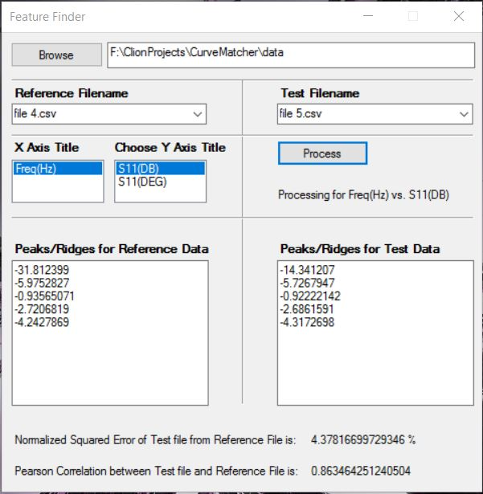

## FeatureFinder

This is an alternate version of the CurveMatcher project which uses the same code but has a Windows Form GUI.

**Languages:** Visual C++

**Framework:** .Net with Windows Forms

**Source**: [https://github.com/apanimesh061/FeatureFinder](https://github.com/apanimesh061/FeatureFinder)

#### Snapshots

This is how the actual GUI looks like:

##### Glossary

| Parts               | Description                                 |
| ------------------- | ------------------------------------------- |
| Browse              | Helps in choosing the folder                |
| Reference Filename  | Choose the reference CSV file from dropdown |
| Test Filename       | Choose the test CSV file from dropdown      |
| X Axis Title        | Title of the X-Axis of the graph            |
| Choose Y Axis Title | Title of the Y-Axis of the graph            |
| Process             | Performs the computation                    |

After you choose a folder that has CSV files:

After you click `Process`:

#### Demo

